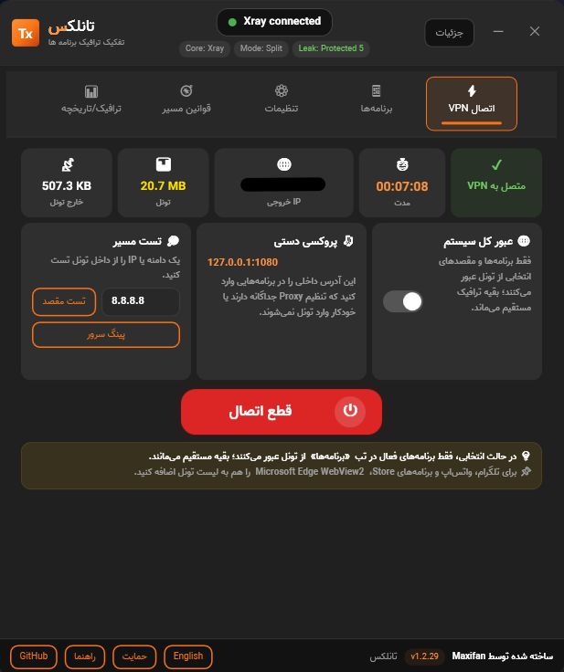
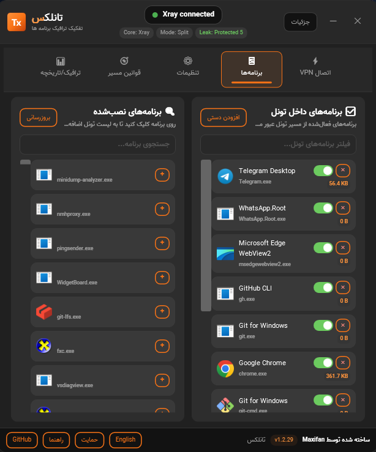
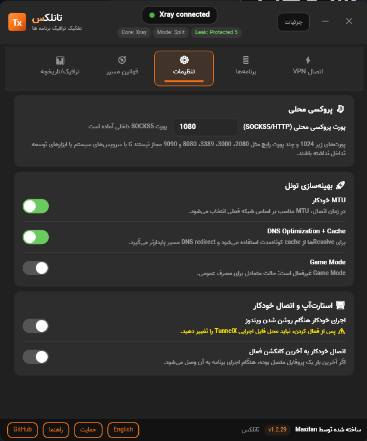
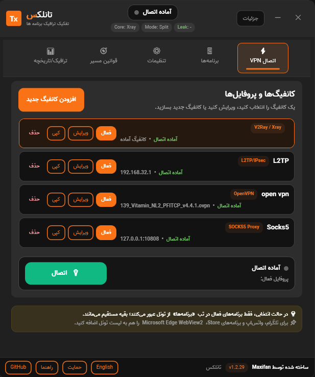

<div dir="rtl" align="right">

# TunnelX

فارسی | <span dir="ltr">[English](README.md)</span> | <span dir="ltr">[Русский](README.md#русский)</span> | <span dir="ltr">[简体中文](README.md#简体中文)</span>

<span dir="ltr">TunnelX</span> یک نرم‌افزار آزاد و رایگان برای ویندوز است که توسط **<span dir="ltr">MaxFan</span>** ساخته شده و برای مدیریت تونل، وی‌پی‌ان و <span dir="ltr">Split Tunneling</span> استفاده می‌شود. این برنامه می‌تواند ترافیک برنامه‌های انتخاب‌شده، مقصدهای مشخص، یا کل سیستم را از تونل عبور دهد و هم‌زمان مسیر عادی شبکه را برای مقصدهای محلی یا مستثنی‌شده حفظ کند. رابط برنامه دو‌زبانه است، زبان سیستم را تشخیص می‌دهد و چینش راست‌به‌چپ/چپ‌به‌راست را برای فارسی و انگلیسی رعایت می‌کند.

## کاربرد برنامه

<span dir="ltr">TunnelX</span> برای زمانی ساخته شده که کاربر نمی‌خواهد تمام ترافیک سیستم از وی‌پی‌ان عبور کند. با این برنامه می‌توان فقط برنامه‌هایی مثل مرورگر، تلگرام، ابزارهای توسعه یا برنامه‌های مشخص دیگر را وارد تونل کرد و بقیه ترافیک سیستم را روی اینترنت عادی نگه داشت. همچنین در صورت نیاز، حالت <span dir="ltr">Full-route</span> برای عبور کل سیستم از تونل در دسترس است.

## قابلیت‌ها

- <span dir="ltr">Split tunneling</span> بر اساس برنامه‌های انتخاب‌شده در ویندوز
- حالت <span dir="ltr">Full-route</span> برای تونل کردن کل سیستم
- پشتیبانی از پروفایل‌های <span dir="ltr">L2TP/IPsec</span> ویندوز
- پشتیبانی از جریان‌های <span dir="ltr">V2Ray</span> بر پایه <span dir="ltr">Xray-core</span> و <span dir="ltr">sing-box</span>
- پشتیبانی از پروفایل‌های اختصاصی <span dir="ltr">SOCKS5/HTTP Proxy</span> با سرور، پورت، نام کاربری و رمز عبور جداگانه
- پشتیبانی از <span dir="ltr">OpenVPN Community</span> با فایل‌های <span dir="ltr">`.ovpn`</span> برای <span dir="ltr">Split tunneling</span> برنامه‌های انتخاب‌شده
- پروکسی <span dir="ltr">SOCKS5</span> محلی روی <span dir="ltr">`127.0.0.1`</span> برای ابزارهایی که تنظیم پروکسی داخلی دارند
- تغییر مسیر <span dir="ltr">DNS</span>، مسدودسازی <span dir="ltr">IPv6</span>، محافظ نشت، عیب‌یابی <span dir="ltr">route</span> و تاریخچه مصرف تونل
- مدیریت چند پروفایل، کپی/ویرایش کانفیگ‌ها، تست سرور، تشخیص <span dir="ltr">IP</span> خروجی و اعلان بروزرسانی
- رابط کاربری فارسی و انگلیسی با تشخیص خودکار زبان، دکمه تغییر زبان و رعایت کامل راست‌به‌چپ/چپ‌به‌راست
- انتخاب پورت داخلی آزاد برای <span dir="ltr">V2Ray/Xray</span> تا خطاهای اشغال بودن پورت‌های <span dir="ltr">`2080/2081`</span> کمتر شود

## شروع سریع

1. آخرین فایل <span dir="ltr">standalone</span> را از بخش <span dir="ltr">GitHub Releases</span> دانلود کنید.
2. برنامه را با دسترسی <span dir="ltr">Administrator</span> اجرا کنید؛ قابلیت‌های تغییر مسیر، <span dir="ltr">WinDivert</span> و مدیریت ترافیک به سطح دسترسی بالا نیاز دارند.
3. از تب اتصال، یک کانفیگ جدید بسازید یا کانفیگ موجود را انتخاب کنید.
4. نوع اتصال را انتخاب کنید: <span dir="ltr">L2TP/IPsec</span>، <span dir="ltr">V2Ray/Xray</span>، <span dir="ltr">SOCKS5/HTTP Proxy</span> یا <span dir="ltr">OpenVPN</span>.
5. قبل از اتصال، تست سرور را اجرا کنید و سپس برنامه‌هایی را که باید از تونل عبور کنند در تب برنامه‌ها فعال کنید.
6. در صورت نیاز، مقصدهای لزومی یا استثنا را اضافه کنید و بعد از اتصال کارت سلامت ترافیک، <span dir="ltr">DNS</span>، <span dir="ltr">IPv6</span> و <span dir="ltr">Route</span> را بررسی کنید.

## انواع اتصال

### <span dir="ltr">L2TP/IPsec</span>

برای اتصال‌های <span dir="ltr">L2TP/IPsec</span>، آدرس سرور، نام کاربری، رمز عبور و <span dir="ltr">Pre-Shared Key</span> را وارد کنید. <span dir="ltr">TunnelX</span> اتصال ویندوز را ایجاد می‌کند و سپس مسیرها را بر اساس حالت انتخابی یا <span dir="ltr">Full-route</span> مدیریت می‌کند.

### <span dir="ltr">V2Ray / Xray</span>

لینک یا کانفیگ <span dir="ltr">V2Ray/Xray</span> را در پروفایل وارد کنید. برنامه برای کانفیگ‌های معمول از <span dir="ltr">sing-box</span> استفاده می‌کند و برای کانفیگ‌هایی که به قابلیت‌های خاص <span dir="ltr">Xray</span> مثل <span dir="ltr">xhttp</span> نیاز دارند، <span dir="ltr">Xray-core</span> را انتخاب می‌کند.

### <span dir="ltr">SOCKS5/HTTP Proxy</span>

اگر از پراکسی آماده استفاده می‌کنید، نوع پروفایل <span dir="ltr">SOCKS5/HTTP Proxy</span> را انتخاب کنید و سرور، پورت و در صورت نیاز نام کاربری و رمز عبور را وارد کنید. این حالت برای عبور برنامه‌های انتخاب‌شده از یک پراکسی خارجی مناسب است و با پراکسی محلی <span dir="ltr">`127.0.0.1`</span> تفاوت دارد.

## پشتیبانی از <span dir="ltr">OpenVPN</span>

<span dir="ltr">TunnelX</span> می‌تواند نسخه نصب‌شده <span dir="ltr">OpenVPN Community</span> و فایل انتخابی <span dir="ltr">`.ovpn`</span> کاربر را اجرا کند و سپس سیاست <span dir="ltr">Split tunneling</span> خودش را اعمال کند؛ یعنی فقط برنامه‌ها و مقصدهای انتخاب‌شده از تونل <span dir="ltr">OpenVPN</span> عبور می‌کنند.

<span dir="ltr">OpenVPN</span> همراه <span dir="ltr">TunnelX</span> توزیع نمی‌شود. برای این حالت باید <span dir="ltr">OpenVPN Community</span> را جداگانه نصب کنید، فایل <span dir="ltr">`.ovpn`</span> را در <span dir="ltr">TunnelX</span> انتخاب کنید و در صورت نیاز نام کاربری و رمز عبور <span dir="ltr">OpenVPN</span> را داخل برنامه وارد کنید. نصب بودن <span dir="ltr">OpenVPN Connect</span> به‌تنهایی برای این حالت کافی نیست، چون آن برنامه مسیرها و <span dir="ltr">DNS</span> را با کلاینت خودش مدیریت می‌کند.

<span dir="ltr">TunnelX</span> برای سازگاری با <span dir="ltr">Split tunneling</span>، تنظیمات مسیر و <span dir="ltr">DNS</span> تحمیلی فایل <span dir="ltr">`.ovpn`</span> را کنترل می‌کند و در صورت تغییر <span dir="ltr">IP</span> تونل، <span dir="ltr">gateway</span>، <span dir="ltr">interface</span> یا مقصد ریموت هنگام <span dir="ltr">reconnect</span>، مسیر‌دهی داخلی خودش را دوباره راه‌اندازی می‌کند.

## نکته‌های مسیر و دامنه

قانون‌های <span dir="ltr">Include</span> و <span dir="ltr">Exclude</span> هم خود دامنه واردشده و هم زیردامنه‌های آن را پوشش می‌دهند. برای نمونه، افزودن <span dir="ltr">`githubusercontent.com`</span> پس از resolve شدن <span dir="ltr">DNS</span> شامل <span dir="ltr">`raw.githubusercontent.com`</span> هم می‌شود. اگر یک کلاینت <span dir="ltr">HTTPS</span> در مرحله بررسی <span dir="ltr">certificate revocation</span> خطا داد، ممکن است میزبان‌های <span dir="ltr">OCSP/CRL</span> آن از مسیر انتخابی قابل دسترسی نباشند؛ در این حالت خود برنامه دانلودکننده یا دامنه‌های revocation مربوطه را هم در لیست لزومی قرار دهید.

- مقصدهای استثناشده حتی برای برنامه‌های انتخاب‌شده مستقیم می‌مانند.
- مقصدهای لزومی حتی اگر برنامه مربوطه انتخاب نشده باشد از تونل عبور می‌کنند.
- برای برنامه‌های <span dir="ltr">Store/MSIX</span>، <span dir="ltr">WebView2</span> یا برنامه‌های چندپردازشی، برنامه را باز نگه دارید و فهرست برنامه‌ها را دوباره بارگذاری کنید.
- اگر <span dir="ltr">Full-route</span> روشن باشد، کل ترافیک سیستم از تونل عبور می‌کند و قانون‌های مستقیم/استثنا همچنان برای نگه داشتن مقصدهای خاص روی مسیر عادی کاربرد دارند.

## تنظیمات و داده‌های محلی

پروفایل‌ها، برنامه‌های انتخاب‌شده، مقصدهای لزومی/استثنا، تاریخچه اتصال و لاگ‌ها روی دستگاه کاربر نگهداری می‌شوند و معمولاً در مسیر <span dir="ltr">`%LOCALAPPDATA%\TunnelX`</span> یا کنار برنامه قرار می‌گیرند. <span dir="ltr">TunnelX</span> عمداً تحلیل آماری یا <span dir="ltr">telemetry</span> برای نگهدارنده ارسال نمی‌کند.

لاگ‌ها ممکن است شامل نام پردازش‌ها، نام دامنه‌ها، آدرس‌های <span dir="ltr">IP</span>، پورت‌ها و وضعیت اتصال باشند. قبل از ارسال عمومی لاگ در <span dir="ltr">GitHub Issues</span>، اطلاعات حساس مثل آدرس سرور خصوصی، کلیدها، <span dir="ltr">UUID</span>، رمزها و endpointهای شخصی را حذف کنید.

## عیب‌یابی سریع

- اگر اتصال برقرار نمی‌شود، اجرای برنامه با دسترسی <span dir="ltr">Administrator</span>، فایروال، درستی کانفیگ، پورت‌های پراکسی و نصب بودن پیش‌نیازهای مربوط به همان نوع اتصال را بررسی کنید.
- اگر ترافیک یک برنامه از تونل عبور نمی‌کند، برنامه را در تب برنامه‌ها فعال کنید، برنامه را باز نگه دارید و فهرست برنامه‌ها را دوباره بارگذاری کنید.
- اگر فقط یک سایت یا دامنه باید از تونل عبور کند، آن را به مقصدهای لزومی اضافه کنید؛ اگر باید مستقیم بماند، آن را به استثناها اضافه کنید.
- اگر خطای <span dir="ltr">DNS</span> یا <span dir="ltr">IPv6</span> می‌بینید، کارت سلامت بعد از اتصال را بررسی کنید و در صورت نیاز یک‌بار قطع و وصل کنید تا مسیرها و قانون‌های <span dir="ltr">DNS</span> دوباره ساخته شوند.
- اگر از <span dir="ltr">OpenVPN</span> استفاده می‌کنید و اتصال طولانی می‌شود، فایل <span dir="ltr">`.ovpn`</span>، نام کاربری/رمز و نصب بودن <span dir="ltr">OpenVPN Community</span> را بررسی کنید.

## تصاویر برنامه

| داشبورد اتصال | تنظیم پروفایل و سرور |
| --- | --- |
|  |  |

| قوانین مسیر | راهنما و عیب‌یابی |
| --- | --- |
|  |  |

## دانلود

فایل‌های آماده اجرا از بخش <span dir="ltr">Releases</span> پروژه منتشر می‌شوند:

<span dir="ltr">[دانلود آخرین نسخه از GitHub Releases](https://github.com/MaxiFan/TunnelX/releases/latest)</span>

فایل‌های منتشرشده توسط <span dir="ltr">GitHub Actions</span> ساخته و آپلود می‌شوند. برای هر فایل اجرایی <span dir="ltr">standalone</span>، فایل checksum با پسوند <span dir="ltr">`.sha256`</span> هم منتشر می‌شود و در متن هر <span dir="ltr">Release</span> لینک اجرای workflow قرار می‌گیرد.

نسخه پیشنهادی برای کاربران، فایل <span dir="ltr">standalone</span> و <span dir="ltr">self-contained</span> است. این نسخه به نصب جداگانه <span dir="ltr">.NET Runtime</span> نیاز ندارد.

## نیازمندی‌های اجرا

- ویندوز <span dir="ltr">10/11</span>
- ویندوز ۶۴ بیتی: <span dir="ltr">`win-x64`</span>
- دسترسی <span dir="ltr">Administrator</span> هنگام اجرا، چون مدیریت <span dir="ltr">route</span> و <span dir="ltr">packet interception</span> به سطح دسترسی بالا نیاز دارد
- نسخه‌های ۳۲ بیتی ویندوز در حال حاضر پشتیبانی نمی‌شوند

## ساخت از سورس

برای توسعه یا ساخت دستی، <span dir="ltr">.NET 8 SDK</span> لازم است:

</div>

```powershell
dotnet build AppTunnel.sln -c Release
dotnet publish AppTunnel\AppTunnel.csproj -c Release -r win-x64 --self-contained true -p:PublishSingleFile=true -p:EnableCompressionInSingleFile=true -p:IncludeNativeLibrariesForSelfExtract=true -p:DebugType=None -p:DebugSymbols=false
```

<div dir="rtl" align="right">

جزئیات بیشتر در <span dir="ltr">`docs/BUILD.md`</span> آمده است. ایده‌ها و برنامه‌های آینده در <span dir="ltr">`docs/ROADMAP.md`</span> نگهداری می‌شوند.

## مجوز

<span dir="ltr">TunnelX</span> تحت مجوز **<span dir="ltr">GPL-3.0-or-later</span>** منتشر شده است. استفاده تجاری با رعایت شرایط <span dir="ltr">GPL</span> مجاز است. اجزای شخص ثالث همراه پروژه مجوزهای خودشان را دارند. برای جزئیات بیشتر:

- <span dir="ltr">`LICENSE`</span>
- <span dir="ltr">`THIRD_PARTY_NOTICES.md`</span>
- <span dir="ltr">`docs/LEGAL.md`</span>

## پشتیبانی، سفارشی‌سازی و حمایت مالی

<span dir="ltr">TunnelX</span> آزاد و رایگان است. حمایت مالی کاملا اختیاری است و فقط به نگهداری و توسعه پروژه کمک می‌کند.

برای ارتباط مستقیم، درخواست پشتیبانی، سفارشی‌سازی خصوصی یا سفارش توسعه، از طریق تلگرام پیام بدهید: <span dir="ltr">[t.me/maxifaan](https://t.me/maxifaan)</span>

خدمات پولی می‌تواند به صورت جداگانه برای پشتیبانی خصوصی، راه‌اندازی، بیلد اختصاصی، سفارشی‌سازی برای شرکت‌ها، یا توسعه برنامه‌ای مشابه ارائه شود. این خدمات پولی حقوقی را که مجوز <span dir="ltr">GPL</span> به کاربران می‌دهد محدود نمی‌کند.

پذیرش تبلیغات ثابت داخل <span dir="ltr">TunnelX</span> امکان‌پذیر است. تبلیغات به‌صورت مستقیم با نگهدارنده هماهنگ می‌شود، از طریق شبکه‌های تبلیغاتی یا سایت‌های واسط نمایش داده نمی‌شود و با هدف ساده، ثابت و امن ماندن تجربه کاربر انجام می‌شود.

گزینه‌های حمایت مالی از طریق <span dir="ltr">GitHub Sponsors/Funding</span> یا فایل <span dir="ltr">`docs/DONATE.md`</span> در دسترس هستند.

## نکته ایمنی و سلب مسئولیت

<span dir="ltr">TunnelX</span> یک ابزار شبکه، تونل و مدیریت مسیر است. فقط در محیط‌هایی از آن استفاده کنید که اجازه استفاده از وی‌پی‌ان، پروکسی، <span dir="ltr">packet capture</span> و تغییر <span dir="ltr">route</span> را دارید. این پروژه مشاوره حقوقی ارائه نمی‌دهد.

این نرم‌افزار همان‌گونه که هست ارائه می‌شود، بدون هیچ‌گونه ضمانت، و نگهدارنده پروژه تعهدی برای ارائه بروزرسانی، رفع اشکال، پشتیبانی یا ادامه دسترسی دائمی ندارد.

</div>
