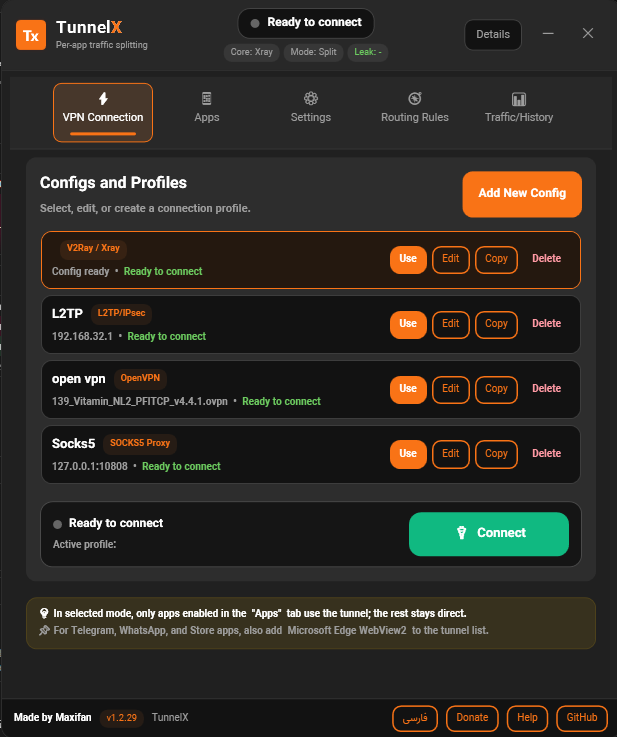
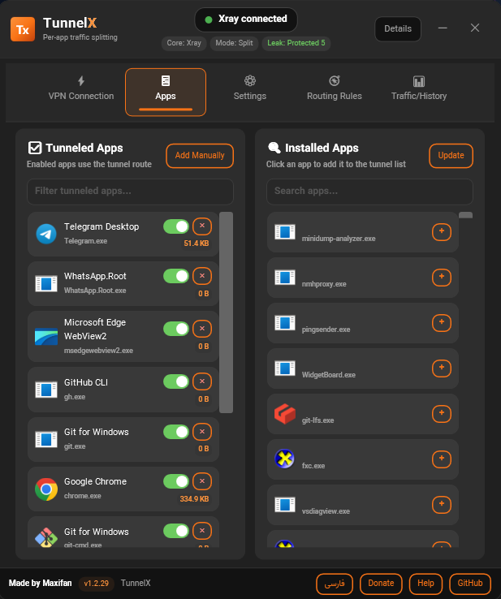
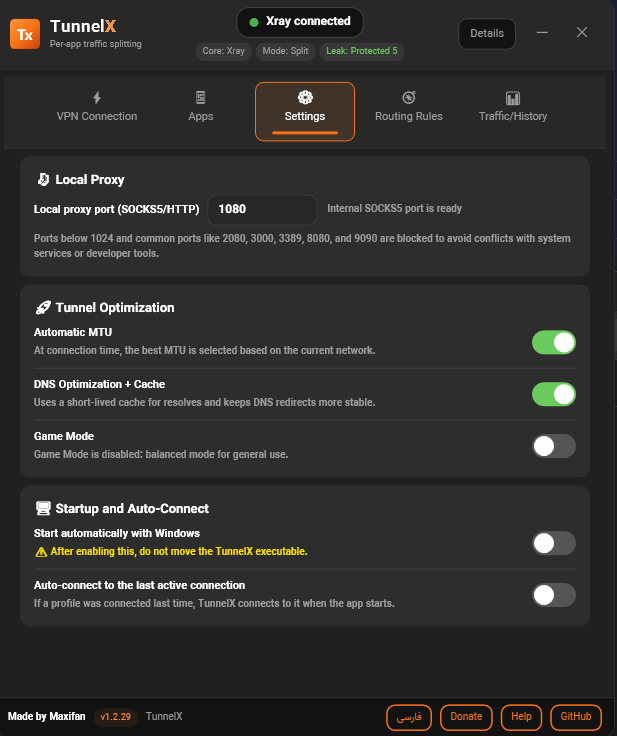
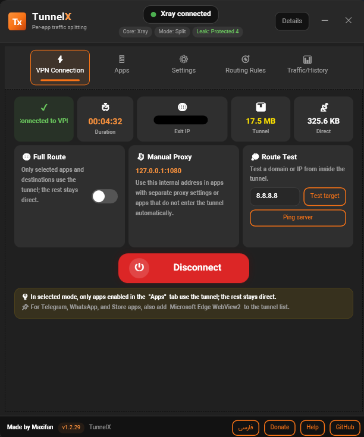

# TunnelX

[فارسی](README.fa.md) · [English](README.md) · Русский · [简体中文](README.zh.md)

**TunnelX** — бесплатный клиент с открытым исходным кодом для Windows (split tunneling) от **MaxFan**. Он направляет через VPN, V2Ray/Xray, OpenVPN или SOCKS5/HTTP Proxy только выбранные приложения, домены/IP или весь системный трафик, сохраняя обычный маршрут для локальных и исключённых назначений. Интерфейс поддерживает персидский и английский языки с автоматическим выбором языка системы и корректным RTL/LTR.

## Обновления в Telegram

Подпишитесь на официальный канал TunnelX, чтобы получать анонсы релизов, уведомления об обновлениях и новости проекта:

**[Канал @tunnelxx в Telegram](https://t.me/tunnelxx)**

Если Telegram установлен в Windows, кнопка в приложении откроет канал напрямую в клиенте Telegram.

## Возможности

- Split tunneling по выбранным процессам Windows
- Режим Full Route для туннелирования всей системы
- Профили Windows L2TP/IPsec
- Рабочие процессы V2Ray на базе Xray-core / sing-box
- Отдельные профили SOCKS5/HTTP Proxy с полями сервера, порта, имени пользователя и пароля
- Поддержка OpenVPN Community через пользовательские файлы `.ovpn` для split tunneling по приложениям
- Поддержка WireGuard через одноранговые файлы `.conf` и sing-box
- Локальный SOCKS5-прокси для инструментов, которым нужен `127.0.0.1`
- Перенаправление DNS, блокировка IPv6, защита от утечек, диагностика маршрутов и история трафика
- Несколько профилей, копирование/редактирование, тесты сервера, определение выходного IP и проверка обновлений
- **Проверка здоровья соединения** перед экраном «подключено»: сквозные TCP-пробы до `google.com` и `cloudflare.com` через SOCKS-туннель с отображением задержки по каждому хосту
- Панель подключения: **выходной IP** с названием страны и флагом (geo и PNG флага загружаются через туннель, не напрямую из локальной сети)
- Уведомления в трее Windows с более понятными подсказками по ошибкам, опциональные заметки о релизе на карточках обновлений и запланированная проверка обновлений после подключения
- Интерфейс на персидском и английском с автоматическим определением языка, ручным переключением и корректным RTL/LTR
- Динамический выбор локальных портов для внутренних компонентов V2Ray/Xray, чтобы реже возникали конфликты привязки `2080/2081`

## Быстрый старт

1. Скачайте последний standalone-релиз из GitHub Releases.
2. Запустите TunnelX от имени Administrator. Управление маршрутами, WinDivert и перехват пакетов требуют повышенных прав.
3. Создайте новый профиль или выберите существующий на вкладке подключения.
4. Выберите тип подключения: L2TP/IPsec, V2Ray/Xray, SOCKS5/HTTP Proxy, OpenVPN или WireGuard.
5. Протестируйте сервер, затем включите приложения Windows, которые должны использовать туннель.
6. При необходимости добавьте include/exclude назначения, подключитесь и проверьте карточки здоровья трафика (DNS, IPv6, утечки, маршруты).

После подключения TunnelX выполняет короткий шаг **проверки здоровья** (проверка адаптера/маршрутов и реальные пробы через туннель). Панель «подключено» появляется только если хотя бы одна сквозная проба успешна. Просроченные или исчерпанные конфиги прокси должны завершаться здесь ошибкой, а не показывать ложное состояние «подключено».

## Выходной IP и флаг страны

Во время подключения TunnelX показывает публичный выходной IP на панели. Название страны и изображение флага — опциональные дополнения:

- Выходной IP запрашивается через локальный SOCKS/mixed-прокси, чтобы запрос выходил через туннель (`ipv4.icanhazip.com`, `api.ipify.org`, `ifconfig.me`).
- Определение страны использует резервные API через тот же путь туннеля: `ip-api.com`, `ipwho.is`, `ipapi.co`.
- Флаг — небольшой PNG с `flagcdn.com` (`/h20/{country-code}.png`), также загружаемый через туннель.

Эти запросы не являются аналитикой, отправляемой разработчику TunnelX; это запросы по требованию от самого приложения. Подробности в `docs/PRIVACY.md`.

## Типы подключения

### L2TP/IPsec

Введите адрес сервера, имя пользователя, пароль и pre-shared key. TunnelX создаёт VPN-подключение Windows и управляет маршрутами согласно политике выбранных приложений или режиму full route.

### V2Ray / Xray

Вставьте ссылку или JSON-конфиг V2Ray/Xray в профиль. TunnelX использует sing-box для обычных конфигов и переключается на Xray-core для конфигов, требующих поведения Xray, например `xhttp`.

### SOCKS5/HTTP Proxy

Используйте профиль SOCKS5/HTTP Proxy, если у вас уже есть внешний прокси. Укажите сервер, порт и при необходимости учётные данные. Это отличается от локального SOCKS5 на `127.0.0.1`, который доступен после подключения для инструментов, нуждающихся в локальном адресе прокси.

### WireGuard

Выберите стандартный файл `.conf` WireGuard или вставьте его содержимое в профиль. TunnelX запускает WireGuard через sing-box и сохраняет маршрутизацию Windows под контролем TunnelX, поэтому split tunneling по приложениям, правила include/exclude, перенаправление DNS, защита от утечек IPv6 и режим full route работают через существующий движок маршрутизации.

Первая реализация WireGuard поддерживает один раздел `[Peer]` на профиль. UDP-тесты endpoint — диагностика best-effort, а не гарантированная проверка handshake; закрытые ключи хранятся локально вместе с данными профиля.

## OpenVPN

TunnelX может запускать установленный **OpenVPN Community** `openvpn.exe` с выбранным пользователем профилем `.ovpn`, затем применять собственную политику split tunneling, чтобы только выбранные приложения и включённые назначения использовали туннель OpenVPN.

OpenVPN не входит в состав TunnelX. Установите OpenVPN Community отдельно, выберите файл `.ovpn` в TunnelX и введите имя пользователя/пароль OpenVPN, если сервер требует учётные данные. Одного OpenVPN Connect недостаточно для этого режима, так как он управляет маршрутами и DNS через свой клиент.

Для совместимости со split tunneling TunnelX подготавливает конфиг OpenVPN, контролируя push маршрутов и DNS. Недавние сборки улучшают стабильность для профилей с несколькими `<connection>`: стабильный порядок портов (443/80 перед 21/53), сохранение блоков `tcp-client`, пропуск неразрешаемых hostname удалённых серверов и более понятная диагностика при сбросе канала управления. Если OpenVPN переподключается и меняет IP туннеля, шлюз, интерфейс или удалённый endpoint, TunnelX перезапускает маршрутизацию пакетов с новыми значениями.

## Заметки о маршрутизации

Правила include/exclude для назначений соответствуют введённому домену и его поддоменам. Например, добавление `githubusercontent.com` также покрывает `raw.githubusercontent.com` после разрешения DNS. Некоторые HTTPS-клиенты могут не пройти проверку отзыва сертификата, если их хосты OCSP/CRL недоступны через выбранный маршрут; добавьте приложение загрузки или соответствующие домены отзыва в список include.

- Исключённые назначения остаются прямыми даже для выбранных приложений.
- Включённые назначения используют туннель, даже если соответствующее приложение не выбрано.
- Для Store/MSIX, WebView2 или многопроцессных приложений держите приложение открытым и обновите список приложений.
- В режиме full route вся система использует туннель; правила direct/exclude всё ещё полезны для конкретных назначений на обычном маршруте.

## Локальные данные и логи

Профили, выбранные приложения, include/exclude назначения, история подключений и логи хранятся на машине пользователя Windows, обычно в `%LOCALAPPDATA%\TunnelX` или рядом с приложением в зависимости от функции. TunnelX намеренно не отправляет аналитику или телеметрию разработчику. Опциональные запросы выходного IP и страны используют сторонние HTTPS-эндпоинты **через туннель**; см. `docs/PRIVACY.md`.

Логи могут содержать имена процессов, hostname, IP-адреса, порты и состояние подключения. Перед публикацией логов удалите учётные данные сервера, UUID, закрытые ключи, частные endpoint и другие чувствительные данные.

## Устранение неполадок

- При сбое подключения проверьте права Administrator, правила брандмауэра, валидность конфига, порты прокси и предварительные требования для выбранного типа подключения.
- Если приложение не использует туннель, включите его на вкладке приложений, держите запущенным и обновите список приложений.
- Если только один сайт или домен должен использовать туннель, добавьте его в include. Если должен оставаться прямым — в исключения.
- Если статус DNS или IPv6 выглядит неверно, проверьте карточки здоровья после подключения и переподключитесь для пересборки маршрутов и правил DNS.
- При задержках OpenVPN проверьте файл `.ovpn`, учётные данные и установку OpenVPN Community.

## Скриншоты

| Панель подключения | Настройка профиля и сервера |
| --- | --- |
|  |  |

| Правила маршрутизации | Справка и устранение неполадок |
| --- | --- |
|  |  |

## Скачать

Публичные сборки публикуются в GitHub Releases:

[Скачать последний релиз](https://github.com/MaxiFan/TunnelX/releases/latest)

Артефакты собираются и загружаются GitHub Actions. К каждому standalone EXE прилагается файл контрольной суммы `.sha256`, а в заметках релиза есть ссылка на workflow run.

## Сборка

Требования для standalone-релиза:

- Windows 10/11
- 64-бит Windows (`win-x64`). 32-бит Windows текущим пакетом не поддерживается.
- Права Administrator при запуске — функции маршрутов и перехвата пакетов требуют повышенного доступа
- Отдельная установка .NET Runtime для self-contained standalone EXE не требуется.

Для сборки из исходников:

- .NET 8 SDK

```powershell
dotnet build AppTunnel.sln -c Release
dotnet publish AppTunnel\AppTunnel.csproj -c Release -r win-x64 --self-contained true -p:PublishSingleFile=true -p:EnableCompressionInSingleFile=true -p:IncludeNativeLibrariesForSelfExtract=true -p:DebugType=None -p:DebugSymbols=false
```

Дополнительные заметки: `CHANGELOG.md`, `docs/BUILD.md`. Конфиденциальность запросов выходного IP: `docs/PRIVACY.md`. Планы: `docs/ROADMAP.md`.

## Лицензия

TunnelX распространяется под **GPL-3.0-or-later**. Коммерческое использование разрешено на условиях GPL. Сторонние компоненты имеют свои лицензии. См.:

- `LICENSE`
- `THIRD_PARTY_NOTICES.md`
- `docs/LEGAL.md`

## Поддержка, кастомизация и пожертвования

TunnelX бесплатен и с открытым исходным кодом. Пожертвования необязательны и помогают поддерживать проект.

Новости и уведомления об обновлениях: **[t.me/tunnelxx](https://t.me/tunnelxx)**.

Для связи, поддержки, частной кастомизации или платной разработки: [t.me/maxifaan](https://t.me/maxifaan).

Платные услуги могут включать частную поддержку, помощь с развёртыванием, кастомные сборки, корпоративную кастомизацию или разработку похожего приложения. Они не ограничивают права по GPL.

Фиксированные рекламные размещения внутри TunnelX возможны по согласованию с автором, без сторонних рекламных сетей.

Варианты пожертвований: кнопка GitHub Funding или `docs/DONATE.md`.

## Предупреждение

TunnelX — инструмент сети и маршрутизации. Используйте только там, где разрешены VPN, прокси, захват пакетов и управление маршрутами. Проект не даёт юридических консультаций.

Программа предоставляется «как есть», без гарантий и без обязательств автора по обновлениям, исправлениям, поддержке или постоянной доступности.
